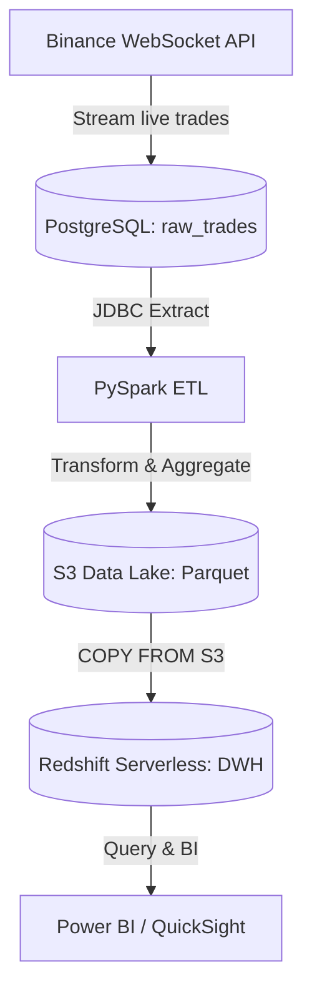

# 🚀 Binance Real-Time ETL Pipeline – Version 2.0


## 📌 Overview
This project implements a **real-time + batch ETL pipeline** for cryptocurrency trades on **Binance**.  
It streams live trades through WebSocket → stores raw data in **PostgreSQL**,  
then performs **daily ETL** using **PySpark**, writing partitioned **Parquet files to Amazon S3**,  
and finally loads curated tables into **Amazon Redshift Serverless** for analytics.  

Everything is fully containerized and orchestrated with **Apache Airflow**.

---

## 🧱 Architecture Summary



### 🔹 Workflow Steps
- **Ingest:** Binance WebSocket → PostgreSQL (`trades` table).
- **Extract:** Spark reads daily snapshot from PostgreSQL via JDBC.
- **Transform:** Generates tables:
  - `dim_time`
  - `dim_symbol` *(only BTCUSDT in this version)*
  - `dim_exchange`
  - `dim_currency`
  - `fact_trades`
- **Load:** Writes Parquet to S3 and loads into Redshift via `COPY` command.
- **Orchestration:** Airflow DAG `daily_binance_etl` runs automatically at 04:00 AM.

---

## 📂 Project Structure
```
BINANCE_ETL/
├── dags/
│   └── etl_dags.py
├── etl/
│   ├── extract.py
│   ├── transform.py
│   ├── load.py
│   ├── transform_logic.py
│   ├── utils.py
│   └── logger.py
├── stream.py                       # Binance WebSocket → PostgreSQL
├── logs/
│   └── dag_log/
│       ├── extract_data/                      
│       ├── transform_data/                    
│       └── load_data/   
├── output/
│   ├── raw/                       # Extracted raw parquet
│   └── clean/                     # Transformed parquet before load
├── Dockerfile                    │
├── docker-compose.yaml           │# Dorker config and airflow
├── airflow.cfg                   │
├── requirements.txt               # Python dependencies  
├── .env.example
├── docs/
│   └── etl_pipeline_v2.png
├── .env
└── README.md
```

---

## ⚙️ Technologies Used

|     Layer     |           Technology           |           Purpose           |
|---------------|--------------------------------|-----------------------------|
| Source        | **Binance WebSocket API**      | Stream trade data           |
| Staging       | **PostgreSQL**                 | Store raw trades            |
| Processing    | **PySpark 3.5.1**              | Transform & aggregate       |
| Data Lake     | **Amazon S3**                  | Partitioned Parquet storage |
| Warehouse     | **Amazon Redshift Serverless** | Analytics-ready DWH         |
| Orchestration | **Apache Airflow 2.x**         | ETL scheduling & retry      |
| Infra         | **Docker Compose**             | Local multi-container setup |
| Logging       | **Custom logger.py**           | Centralized ETL logs        |

---

## 🧮 ETL Logic Summary

### **1️⃣ Extract**
Reads raw trade data from PostgreSQL (trades table).  
Writes daily raw snapshot to `/opt/airflow/output/raw/`.

### **2️⃣ Transform**
Produces five curated tables aligned with Redshift schema:

|      Table       |                     Description                     |
|------------------|-----------------------------------------------------|
| **dim_time**     | Time dimension (year, month, day, hour, minute).    |
| **dim_symbol**   | Trading pair list (`BTCUSDT` only in this version). |
| **dim_exchange** | Exchange info (`binance`).                          |
| **dim_currency** | Derived currency IDs (BTC, USDT).                   |
| **fact_trades**  | Aggregated per-minute trade stats.                  |

### **3️⃣ Load**
Each table is written to S3 under:  
`s3://S3_BUCKET/S3_PREFIX/{table}/year=YYYY/month=MM/day=DD/`

Redshift loads Parquet via:
```sql
COPY public.fact_trades
FROM `s3://S3_BUCKET/S3_PREFIX/{table}/year=YYYY/month=MM/day=DD/`'
IAM_ROLE 'arn:aws:iam::<account>:role/RedshiftS3AccessRole'
FORMAT AS PARQUET;
```

---

## 📊 Example Data Preview

### **dim_symbol**
| symbol_id | symbol  |
|-----------|---------|
| 1         | BTCUSDT |

### **fact_trades**
| symbol | trade_minute         | base_currency_id | quote_currency_id | exchange_id | min_price | max_price | avg_price | total_quantity | total_trade_value |
|---------|---------------------|------------------|-------------------|-------------|-----------|-----------|-----------|----------------|-------------------|
| BTCUSDT | 2025-10-20 13:53:00 | BTC              | USDT              | binance     | 111014.48 | 111075    | 111050.80 | 2.18           | 240598.03 |
| BTCUSDT | 2025-10-20 13:54:00 | BTC              | USDT              | binance     | 111080.07 | 111108.52 | 111087.34 | 13.59          | 1509979.08 |
| BTCUSDT | 2025-10-20 13:55:00 | BTC              | USDT              | binance     | 111014.39 | 111063.46 | 111029.27 | 7.63           | 848481.80 |
| BTCUSDT | 2025-10-20 13:56:00 | BTC              | USDT              | binance     | 110986.68 | 111079.40 | 111029.36 | 7.83           | 870095.35 |
| BTCUSDT | 2025-10-20 13:57:00 | BTC              | USDT              | binance     | 110988.51 | 111049.96 | 111015.38 | 5.56           | 617853.23 |

*(Data from Redshift after successful load, sample for BTCUSDT pair)*

---

## 🧾 Logging & Monitoring
- Structured logging via `logger.py` → `/opt/airflow/logs/`.
- Each stage (extract, transform, load) writes duration & row count.
- Airflow retries failed tasks once (`retries = 1`, `delay = 5 min`).

---

## 🧰 How to Run

### 1️⃣ Start services
```bash
docker-compose up -d --build
```

### 2️⃣ Access UIs
- Airflow → http://localhost:8081  
- pgAdmin → http://localhost:8080  

### 3️⃣ Trigger DAG
```bash
docker exec -it binance-scheduler airflow dags trigger daily_binance_etl
```

### 4️⃣ Check Logs
```bash
docker logs -f binance-scheduler
```

---

## ✅ Version 2.0 Highlights

|      Feature      |          Status           |                  Notes                 |
|-------------------|---------------------------|----------------------------------------|
| ETL Flow          | Working end-to-end        | Extract → Transform → Load to Redshift |
| Fact Data         | Realistic BTCUSDT trades  | Includes base/quote/exchange IDs       | 
| Dim Tables        | Updated 5 dimensions      | Schema aligned with Redshift           |
| Logging           | Structured logger         | Stored in `/opt/airflow/logs`          |
| Airflow           | Scheduled daily           | DAG `daily_binance_etl`                |
| Schema Alignment  | Fixed column order & type | Prevented Spectrum Scan errors         |

---

## 🧭 Next Steps
- Add multiple trading pairs (ETHUSDT, SOLUSDT…).  
- Introduce data validation and quality checks.  
- Automate daily dashboard refresh in Power BI.  
- Deploy pipeline to AWS ECS or Glue.  
- Add CI/CD workflow for Docker build & DAG sync.

---

## ✍️ Author
**Nguyễn Ngọc Đức**  
_Data Engineer | Binance ETL Pipeline v2.0_  
📧 ducdataengineer@gmail.com  
🌐 [github.com/etl-project-simple](https://github.com/etl-project-simple)
