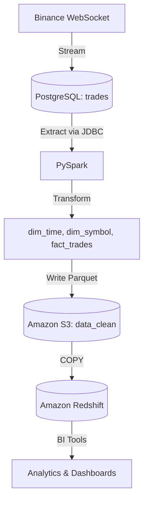

# Binance Real-Time ETL Pipeline

## 📌 Overview
This project implements an **end-to-end ETL pipeline** for real-time cryptocurrency trades (Binance).  
The system streams raw trades from the Binance WebSocket API into PostgreSQL, processes them daily with **PySpark**, stores clean data in **Amazon S3**, and loads dimension/fact tables into **Amazon Redshift** for analytics.  
The pipeline is fully orchestrated with **Apache Airflow**.

---

## 📐 Architecture


**Workflow:**
1. **Ingestion:** Binance WebSocket → PostgreSQL (`trades` table).  
2. **Extraction:** PySpark reads data via JDBC.  
3. **Transformation:** Create dimension and fact tables (`dim_time`, `dim_symbol`, `fact_trades`).  
4. **Load:** Write Parquet to **Amazon S3** and COPY into **Amazon Redshift**.  
5. **Orchestration:** Daily scheduled ETL with Airflow at 04:00.  

---

## 📂 Project Structure
```
.
├── dags/
│   └── etl_dags.py          # Airflow DAG to orchestrate ETL
├── etl/
│   ├── extract.py           # Extract trades from PostgreSQL → Spark
│   ├── transform.py         # Transform into dim_time, dim_symbol, fact_trades
│   ├── load.py              # Load Parquet to S3 + COPY into Redshift
│   ├── utils.py             # Helper for JDBC connections
│   └── main.py              # Main ETL entrypoint
├── stream.py                # Binance WebSocket → PostgreSQL (real-time ingestion)
├── requirements.txt         # Python dependencies
├── Dockerfile               # Container image for Airflow/Spark
├── docker-compose.yaml      # Local orchestration (Airflow, PostgreSQL, etc.)
├── airflow.cfg              # Airflow configs
├── .env                     # Environment variables (AWS, Redshift, Postgres)
```

---

## ⚙️ Pipeline Architecture


---

## 🚀 Features
- **Streaming ingestion** (`stream.py`) from Binance WebSocket into PostgreSQL.
- **Daily batch ETL** with PySpark:
  - `dim_time`: timestamp dimension
  - `dim_symbol`: distinct symbols
  - `fact_trades`: aggregated trade facts (min, max, avg price, volume, value).
- **Data Lake** on S3 (partitioned by `year/month/day`).
- **Data Warehouse** on Redshift with COPY from S3.
- **Orchestration** using Apache Airflow (DAG scheduled daily at 04:00).

---

## 🛠️ Installation & Setup

### 1. Clone repository
```bash
git clone https://github.com/<your-username>/binance-etl.git
cd binance-etl
```

### 2. Create .env file (based on .env.simple)
```bash
cp .env.example .env
```

### 3. Build & start services
```bash
docker-compose up -d --build
```

- Airflow UI → [http://localhost:8080](http://localhost:8080)  
- PostgreSQL → `localhost:5432`  

---

## 📊 Demo Results

After a daily run, transformed tables are written:

✅ **S3 (Parquet):**
```
s3://binance81/data_clean/dim_time/year=2025/month=09/day=10/
s3://binance81/data_clean/dim_symbol/year=2025/month=09/day=10/
s3://binance81/data_clean/fact_trades/year=2025/month=09/day=10/
```

✅ **Redshift Tables:**
```sql
SELECT COUNT(*) FROM public.fact_trades;   -- Fact table
SELECT * FROM public.dim_symbol LIMIT 5;   -- Dimension table
```

---

## 🧾 Example Output

### 1. `dim_time`
| datetime            | year | month | day | hour | minute |
|---------------------|------|-------|-----|------|--------|
| 2025-09-10 04:00:00 | 2025 | 9     | 10  | 4    | 0      |
| 2025-09-10 04:01:00 | 2025 | 9     | 10  | 4    | 1      |

---

### 2. `dim_symbol`
| symbol |
|--------|
| BTCUSDT|
| ETHUSDT|

---

### 3. `fact_trades`
| symbol  | trade_minute       | min_price | max_price | avg_price | total_quantity | total_trade_value |
|---------|--------------------|-----------|-----------|-----------|----------------|-------------------|
| BTCUSDT | 2025-09-10 04:00:00| 57000.10  | 57005.50  | 57002.80  | 1.52           | 86763.21          |
| BTCUSDT | 2025-09-10 04:01:00| 57006.00  | 57020.75  | 57012.90  | 0.85           | 48460.96          |
| ETHUSDT | 2025-09-10 04:00:00| 2200.30   | 2205.70   | 2203.25   | 12.50          | 27540.62          |

---

## 📦 Dependencies
See [`requirements.txt`](requirements.txt):
- PySpark 3.5.1
- pandas, pyarrow
- psycopg2-binary
- boto3 / botocore
- apache-airflow-providers-{amazon,spark}

---

## 📅 Airflow DAG
- DAG ID: **daily_binance_etl**
- Schedule: `0 4 * * *` (04:00 daily)
- Task: `run_etl_pipeline`

---

## 📈 Future Improvements
- Multi-symbol streaming (BTC, ETH, …).
- Near-real-time micro-batch Spark Structured Streaming.
- Data quality checks before Redshift load.
- Dashboard integration with Amazon QuickSight or Power BI.
